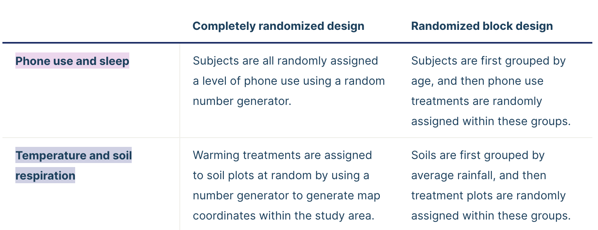

# A guide to experimental design

https://www.scribbr.com/methodology/experimental-design/

**Experiments** are used to study [causal relationships](https://www.scribbr.com/methodology/correlation-vs-causation/). You manipulate one or more[ independent variables](https://www.scribbr.com/methodology/independent-and-dependent-variables/) and measure their effect on one or more dependent variables.

**Experimental design** means creating a set of procedures to systematically [test a hypothesis](https://www.scribbr.com/statistics/hypothesis-testing/). A good experimental design requires a strong understanding of the system you are studying.

There are five key steps in designing an experiment:

1. Consider your **variables** and how they are related
2. Write a specific, testable **hypothesis**
3. Design experimental treatments to manipulate your **independent variable**
4. Assign subjects to groups, either **between-subjects** or **within-subjects**
5. Plan how you will measure your **dependent variable**

For valid conclusions, you also need to select a representative [sample](https://www.scribbr.com/methodology/population-vs-sample/) and control any [extraneous variables](https://www.scribbr.com/methodology/extraneous-variables/) that might influence your results.

## Step 1: Define your variables

You should begin with a specific [research question](https://www.scribbr.com/research-process/research-questions/).

To translate your research question into an experimental hypothesis, you need to define the main variables and make predictions about how they are related.

Start by simply listing the[ independent and dependent variables](https://www.scribbr.com/methodology/independent-and-dependent-variables/).

Then you need to think about possible [extraneous](https://www.scribbr.com/methodology/extraneous-variables/) and[ confounding variables](https://www.scribbr.com/methodology/confounding-variables/) and consider how you might [control](https://www.scribbr.com/methodology/control-variable/) them in your experiment.

## Step 2: Write your hypothesis

Now that you have a strong conceptual understanding of the system you are studying, you should be able to write a specific, testable [hypothesis](https://www.scribbr.com/methodology/hypotheses/) that addresses your research question.

## Step 3: Design your experimental treatments

How you manipulate the independent variable can affect the experiment’s [external validity](https://www.scribbr.com/methodology/internal-vs-external-validity/) – that is, the extent to which the results can be generalized and applied to the broader world.

First, you may need to decide how **widely** to vary your independent variable.

Second, you may need to choose how **finely** to vary your independent variable. Sometimes this choice is made for you by your experimental system, but often you will need to decide, and this will affect how much you can infer from your results.

- categorical variable
- continuous variable

## Step 4: Assign your subjects to treatment groups

How you apply your experimental treatments to your test subjects is crucial for obtaining [valid and reliable](https://www.scribbr.com/methodology/reliability-vs-validity/) results.

First, you need to consider the  **study size** : how many individuals will be included in the experiment? In general, the more subjects you include, the greater your experiment’s[ statistical power](https://www.scribbr.com/statistics/statistical-power/), which determines how much confidence you can have in your results.

Then you need to [randomly assign](https://www.scribbr.com/methodology/random-assignment/) your subjects to  **treatment groups** . Each group receives a different level of the treatment (e.g. no phone use, low phone use, high phone use).

You should also include a [**control group**](https://www.scribbr.com/methodology/control-group/), which receives no treatment. The control group tells us what would have happened to your test subjects without any experimental intervention.

When assigning your subjects to groups, there are two main choices you need to make:

1. A **completely randomized design** vs a  **randomized block design** .
2. A **between-subjects design**  vs a **within-subjects design**.

### Randomization

An experiment can be completely randomized or randomized within blocks (aka strata):

* In a  **completely randomized design** , every subject is assigned to a treatment group at random.
* In a **randomized block design** (aka stratified random design), subjects are first grouped according to a characteristic they share, and then randomly assigned to treatments within those groups.

Sometimes randomization isn’t practical or [ethical](https://www.scribbr.com/methodology/research-ethics/), so researchers create partially-random or even non-random designs. An experimental design where treatments aren’t randomly assigned is called a [**quasi-experimental design**](https://www.scribbr.com/methodology/quasi-experimental-design/).

### Between-subjects vs. within-subjects

In a **[between-subjects design](https://www.scribbr.com/methodology/between-subjects-design/)** (also known as an independent measures design or classic [ANOVA](https://www.scribbr.com/statistics/one-way-anova/) design), individuals receive only one of the possible levels of an experimental treatment.

In medical or social research, you might also use **matched pairs** within your between-subjects design to make sure that each treatment group contains the same variety of test subjects in the same proportions.

In a [**within-subjects design**](https://www.scribbr.com/methodology/within-subjects-design/) (also known as a repeated measures design), every individual receives each of the experimental treatments consecutively, and their responses to each treatment are measured.

Within-subjects or repeated measures can also refer to an experimental design where an effect emerges over time, and individual responses are measured over time in order to measure this effect as it emerges.

**Counterbalancing** (randomizing or reversing the order of treatments among subjects) is often used in within-subjects designs to ensure that the order of treatment application doesn’t influence the results of the experiment.

## Step 5: Measure your dependent variable

Finally, you need to decide how you’ll collect data on your dependent variable outcomes. You should aim for [reliable and valid](https://www.scribbr.com/methodology/reliability-vs-validity/) measurements that minimize bias or error.

Some variables, like temperature, can be objectively measured with scientific instruments. Others may need to be [operationalized](https://www.scribbr.com/dissertation/operationalization/) to turn them into measurable observations.
