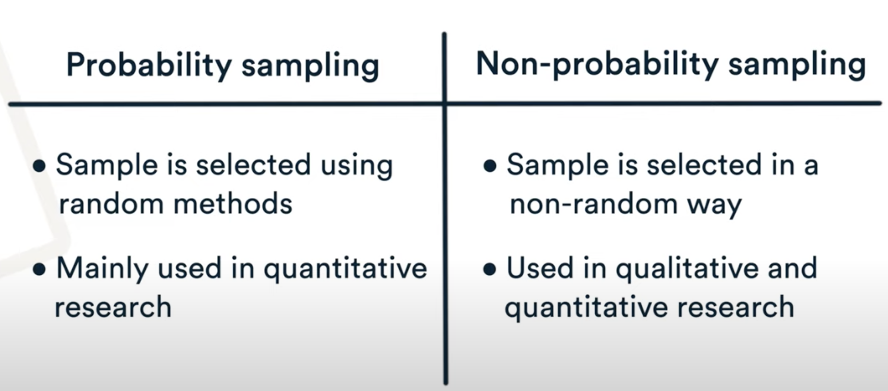

# Population vs sample: what’s the difference?

https://www.scribbr.com/methodology/population-vs-sample/

A **population** is the entire group that you want to draw conclusions about.

A **sample** is the specific group that you will collect data from. The size of the sample is always less than the total size of the population.

In research, a population doesn’t always refer to people. It can mean a group containing elements of anything you want to study, such as objects, events, organizations, countries, species, organisms, etc.

#### Population vs sample

| Population                                    | Sample                                                                                                    |
| --------------------------------------------- | --------------------------------------------------------------------------------------------------------- |
| Advertisements for IT jobs in the Netherlands | The top 50 search results for advertisements for IT jobs in the Netherlands on May 1, 2020                |
| Songs from the Eurovision Song Contest        | Winning songs from the Eurovision Song Contest that were performed in English                             |
| Undergraduate students in the Netherlands     | 300 undergraduate students from three Dutch universities who volunteer for your psychology research study |
| All countries of the world                    | Countries with published data available on birth rates and GDP since 2000                                 |

The more precisely you define your population, the easier will be to gather a representative sample

## Population parameter vs sample statistic

When you collect data from a population or a sample, there are various measurements and numbers you can calculate from the data. A [**parameter**](https://www.scribbr.com/statistics/parameter-vs-statistic/) is a measure that describes the whole population. A **statistic** is a measure that describes the sample.

You can use estimation or [hypothesis testing](https://www.scribbr.com/statistics/hypothesis-testing/) to estimate how likely it is that a sample statistic differs from the population parameter.

Research example: Parameters and statistics

In your study of students’ political attitudes, you ask your survey participants to rate themselves on a scale from 1, very liberal, to 7, very conservative. You find that most of your sample identifies as liberal – the mean rating on the political attitudes scale is 3.2.

You can use this  **statistic** , the sample mean of 3.2, to make a scientific guess about the **population parameter** – that is, to infer the mean political attitude rating of all undergraduate students in the Netherlands.
